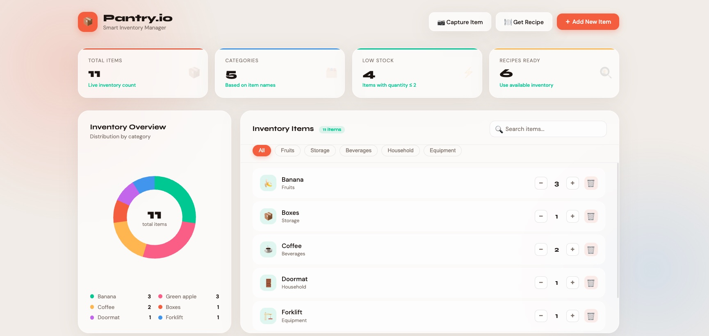

# 🥦 AI-Powered Food Inventory Management System

> An intelligent pantry tracker with real-time inventory management, AI image recognition, and smart recipe suggestions.



---

## 🌟 Features

- **Real-time inventory tracking** — Keep your pantry up to date instantly
- **AI-powered image recognition** — Add items just by taking a photo
- **Smart recipe suggestions** — Get meal ideas based on what you have
- **Dark mode** — Easy on the eyes, day or night
- **Search functionality** — Quickly find any item in your inventory
- **Responsive design** — Works seamlessly on desktop and mobile

---

## 🛠️ Tech Stack

<p align="center">
  
</p>

| Category | Technology |
|----------|------------|
| Framework | [Next.js](https://nextjs.org/) |
| UI Library | [React](https://reactjs.org/) + [Material-UI](https://material-ui.com/) |
| Styling | [Tailwind CSS](https://tailwindcss.com/) |
| Database | [Firebase](https://firebase.google.com/) |
| AI / Vision | [OpenAI API](https://openai.com/api/) |
| LLM Routing | [OpenRouter API](https://openrouter.ai/docs/quick-start) |

---

## 🏁 Getting Started

### Prerequisites

- Node.js (v18 or higher recommended)
- A [Firebase](https://console.firebase.google.com/) project
- An [OpenRouter](https://openrouter.ai/) API key

### Installation

1. **Clone the repository**

   ```bash
   git clone https://github.com/ashevkar/inventory_tracker.git
   cd inventory_tracker
   ```

2. **Install dependencies**

   ```bash
   npm install
   ```

3. **Configure environment variables**

   Create a `.env.local` file in the root directory and add the following:

   ```env
   # OpenRouter
   NEXT_PUBLIC_OPENROUTER_ENDPOINT=your_openrouter_endpoint
   OPENROUTER_API_KEY=your_openrouter_api_key

   # Firebase
   FIREBASE_API_KEY=your_firebase_api_key
   NEXT_PUBLIC_FIREBASE_AUTH_DOMAIN=your_firebase_auth_domain
   NEXT_PUBLIC_FIREBASE_PROJECT_ID=your_firebase_project_id
   NEXT_PUBLIC_FIREBASE_STORAGE_BUCKET_NAME=your_firebase_storage_bucket
   FIREBASE_MESSAGING_SENDER_ID=your_firebase_messaging_sender_id
   FIREBASE_APP_ID=your_firebase_app_id
   FIREBASE_MEASUREMENT_ID=your_firebase_measurement_id
   ```

   **Getting your Firebase credentials:**
   1. Go to the [Firebase Console](https://console.firebase.google.com/)
   2. Click **Add project** or select an existing one
   3. Follow the setup wizard
   4. Click the web icon (`</>`) to register a web app
   5. Copy the provided configuration values into your `.env.local`

   **Getting your OpenRouter API key:** Sign up at [OpenRouter](https://openrouter.ai/) and generate a key from your dashboard.

4. **Start the development server**

   ```bash
   npm run dev
   ```

5. Open [http://localhost:3000](http://localhost:3000) in your browser.

---

## 🐛 Troubleshooting

**Dependencies not installing?**
```bash
npm install
```

**Stale build causing issues?**
```bash
rm -rf .next
npm run build
```

**OpenAI/OpenRouter not working?**
- Verify your API key is correctly set in `.env.local`
- Ensure your account has sufficient credits
- Check that `pages/api/object-detection.js` is correctly configured to proxy API requests (avoids CORS issues)

---

## 📁 Project Structure

```
inventory_tracker/
├── pages/
│   ├── api/
│   │   └── object-detection.js   # AI image recognition endpoint
│   └── index.js                  # Main app entry
├── components/                   # Reusable UI components
├── firebase/                     # Firebase config and helpers
├── public/                       # Static assets
└── .env.local                    # Environment variables (not committed)
```

---

## 🤝 Contributing

Contributions, issues, and feature requests are welcome! Feel free to open an [issue](https://github.com/ashevkar/inventory_tracker/issues) or submit a pull request.

---

## 👤 Author

**Aishwarya Shevkar**

[](https://www.linkedin.com/in/aish06/)
[](https://github.com/ashevkar)

---

## 📄 License

This project is open source. Feel free to use and adapt it for your own learning or projects.